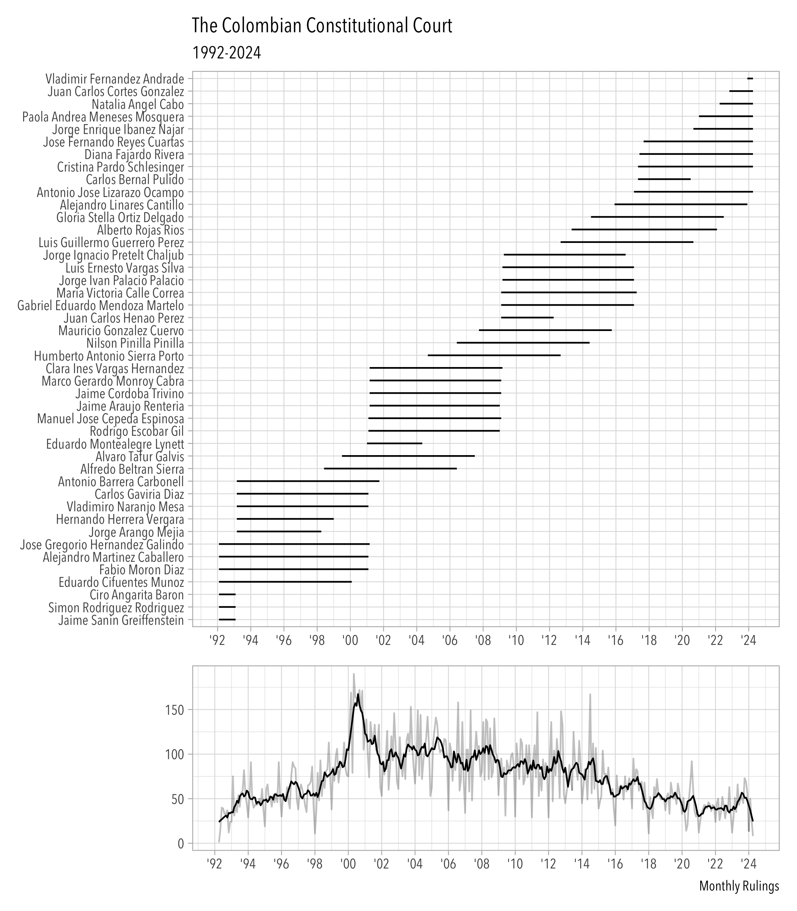

<!-- README.md is generated from README.Rmd. Please edit that file -->

# cccLLM

<!-- badges: start -->

[](https://github.com/acastroaraujo/cccLLM/actions/workflows/R-CMD-check.yaml)

<!-- badges: end -->

This package contains a collection of datasets about the Colombian
Constitutional Court. Most of them were processed with the help of Large
Language Models. It is meant to complement the datasets collected in the
[ccc](https://acastroaraujo.github.io/ccc/) package.

## Installation

You can install the development version of cccLLM from
[GitHub](https://github.com/) with:

``` r
# install.packages("pak")
pak::pak("acastroaraujo/cccLLM")
```

To cite `cccLLM` in publications use:

    @Manual{,
      title = {cccLLM: Colombian Constitutional Court Datasets},
      author = {Andrés {Castro Araújo}},
      year = {2025},
      note = {R package version 0.1.0},
      url = {https://github.com/acastroaraujo/cccLLM},
    }



## Convenience Functions

``` r
library(cccLLM)

summary_ruling("C-370-06")
#> 
#> ── Ruling: C-370-06 ────────────────────────────────────────────────────────────
#> La Corte Constitucional analizó la constitucionalidad de la Ley 975 de 2005,
#> conocida como Ley de Justicia y Paz, la cual fue promulgada como parte del
#> proceso de desmovilización de grupos armados ilegales en Colombia. La sentencia
#> resolvió múltiples demandas que cuestionaban tanto aspectos sustantivos como
#> formales de la ley, particularmente en lo relacionado con los derechos de las
#> víctimas a la verdad, justicia y reparación, y las obligaciones del Estado
#> colombiano conforme al derecho internacional. La Corte declaró la exequibilidad
#> de la mayoría de los artículos, pero declaró inexequibles los artículos 70 y 71
#> por vicios de procedimiento en su formación. También se reiteró que la Ley no
#> constituía una ley de amnistía o indulto. El fallo generó varios salvamentos y
#> aclaraciones de voto.
#> ────────────────────────────────────────────────────────────────────────────────
#> The Constitutional Court reviewed the constitutionality of Law 975 of 2005,
#> known as the Justice and Peace Law, enacted in the context of the
#> demobilization of illegal armed groups in Colombia. The ruling addressed
#> numerous claims challenging both substantive and procedural aspects of the law,
#> especially regarding the rights of victims to truth, justice, and reparation,
#> and Colombia’s obligations under international law. The Court upheld most of
#> the law but declared Articles 70 and 71 unconstitutional due to procedural
#> flaws. It also emphasized that the law did not grant amnesty or pardons. The
#> ruling was accompanied by several dissenting and concurring opinions.
summary_ruling("SU-096-18")
#> 
#> ── Ruling: SU-096-18 ───────────────────────────────────────────────────────────
#> La sentencia SU-096-18 de la Corte Constitucional de Colombia aborda el caso de
#> una mujer, Emma, quien presentó una acción de tutela contra la EPS Compensar
#> debido a la negativa de esta y sus IPS de practicarle un procedimiento de
#> interrupción voluntaria del embarazo (IVE) por malformación fetal incompatible
#> con la vida. Emma fue diagnosticada con un embarazo de un feto con
#> holoprosencefalia, una malformación del sistema nervioso central. A pesar de
#> contar con la orden médica para la IVE, enfrentó múltiples barreras
#> administrativas y negativas por parte de varias instituciones de salud. La
#> Corte Constitucional, en Sala Plena, revisó el caso y determinó que la EPS
#> vulneró los derechos fundamentales de Emma al no autorizar y practicar el
#> procedimiento de IVE de manera oportuna. La Corte confirmó la sentencia de
#> primera instancia que declaró la carencia actual de objeto por hecho superado,
#> ya que el procedimiento fue finalmente realizado. Además, la Corte exhortó al
#> Congreso a regular el derecho a la IVE y ordenó al Ministerio de Salud emitir
#> una regulación para garantizar el acceso a la IVE en los casos despenalizados.
#> ────────────────────────────────────────────────────────────────────────────────
#> The SU-096-18 ruling by the Colombian Constitutional Court addresses the case
#> of a woman, Emma, who filed a tutela action against EPS Compensar due to their
#> refusal to perform a voluntary termination of pregnancy (IVE) procedure for a
#> fetus with a life-incompatible malformation. Emma was diagnosed with a
#> pregnancy involving a fetus with holoprosencephaly, a central nervous system
#> malformation. Despite having a medical order for the IVE, she faced multiple
#> administrative barriers and refusals from various health institutions. The
#> Constitutional Court, in full chamber, reviewed the case and determined that
#> the EPS violated Emma's fundamental rights by not authorizing and performing
#> the IVE procedure in a timely manner. The Court confirmed the first-instance
#> ruling that declared the case moot due to the procedure being eventually
#> carried out. Additionally, the Court urged Congress to regulate the right to
#> IVE and ordered the Ministry of Health to issue regulations to ensure access to
#> IVE in decriminalized cases.

print_article(11)
#> 
#> ── Art. 11 ─────────────────────────────────────────────────────────────────────
#> Artículo 11. El derecho a la vida es inviolable. No habrá pena de muerte.
#> ────────────────────────────────────────────────────────────────────────────────
#> Título 2: De los derechos, las garantías y los deberes
#> Capítulo 1: De los derechos fundamentales
print_article(363)
#> 
#> ── Art. 363 ────────────────────────────────────────────────────────────────────
#> Artículo 363. El sistema tributario se funda en los principios de equidad,
#> eficiencia y progresividad. Las leyes tributarias no se aplicarán con
#> retroactividad.
#> ────────────────────────────────────────────────────────────────────────────────
#> Título 12: Del régimen económico y de la hacienda pública
#> Capítulo 4: De la distribución de recursos y de las competencias
```

## Dataset Examples

``` r
glimpse(rulings)
#> Rows: 28,245
#> Columns: 12
#> $ id         <chr> "T-001-92", "C-004-92", "T-002-92", "C-005-92", "T-003-92",…
#> $ date       <date> 1992-04-03, 1992-05-07, 1992-05-08, 1992-05-11, 1992-05-11…
#> $ type       <fct> T, C, T, C, T, T, T, T, T, T, T, T, T, T, T, C, T, T, T, T,…
#> $ chamber    <fct> SR, SP, SR, SP, SR, SR, SR, SR, SR, SR, SR, SR, SR, SR, SR,…
#> $ rj         <fct> no, no, no, no, no, no, no, no, no, no, no, no, no, no, no,…
#> $ n_person   <int> 3, 7, 3, 7, 3, 3, 3, 3, 3, 3, 3, 3, 3, 3, 3, 7, 3, 3, 3, 3,…
#> $ n_av       <int> 0, 0, 0, 0, 0, 0, 0, 0, 0, 0, 0, 0, 0, 0, 0, 0, 1, 0, 0, 0,…
#> $ n_sv       <int> 0, 1, 0, 2, 0, 1, 0, 0, 0, 0, 0, 0, 0, 0, 0, 0, 0, 0, 0, 0,…
#> $ n_amicus   <int> 0, 3, 0, 1, 0, 0, 0, 0, 0, 0, 0, 0, 0, 0, 0, 0, 0, 0, 0, 0,…
#> $ summary_en <chr> "The ruling T-001-92 of the Colombian Constitutional Court …
#> $ summary_es <chr> "La sentencia T-001-92 de la Corte Constitucional de Colomb…
#> $ model      <chr> "gpt-4o", "gpt-4o", "gpt-4o", "gpt-4o", "gpt-4o", "gpt-4o",…
glimpse(person)
#> Rows: 131,484
#> Columns: 7
#> $ id      <chr> "C-001-18", "C-001-18", "C-001-18", "C-001-18", "C-001-18", "C…
#> $ name    <chr> "luis guillermo guerrero perez", "carlos bernal pulido", "dian…
#> $ mp      <lgl> FALSE, FALSE, TRUE, FALSE, FALSE, FALSE, FALSE, FALSE, FALSE, …
#> $ av      <lgl> FALSE, FALSE, FALSE, FALSE, FALSE, FALSE, FALSE, FALSE, FALSE,…
#> $ sv      <lgl> FALSE, TRUE, FALSE, FALSE, FALSE, FALSE, FALSE, FALSE, FALSE, …
#> $ interim <lgl> FALSE, FALSE, FALSE, FALSE, FALSE, FALSE, FALSE, FALSE, FALSE,…
#> $ conjuez <lgl> FALSE, FALSE, FALSE, FALSE, FALSE, FALSE, FALSE, FALSE, FALSE,…
glimpse(articles)
#> Rows: 124,021
#> Columns: 2
#> $ id      <chr> "C-001-18", "C-001-18", "C-001-18", "C-001-18", "C-001-18", "C…
#> $ article <dbl> 1, 13, 17, 241, 243, 29, 158, 13, 25, 26, 28, 241, 256, 152, 9…
```
