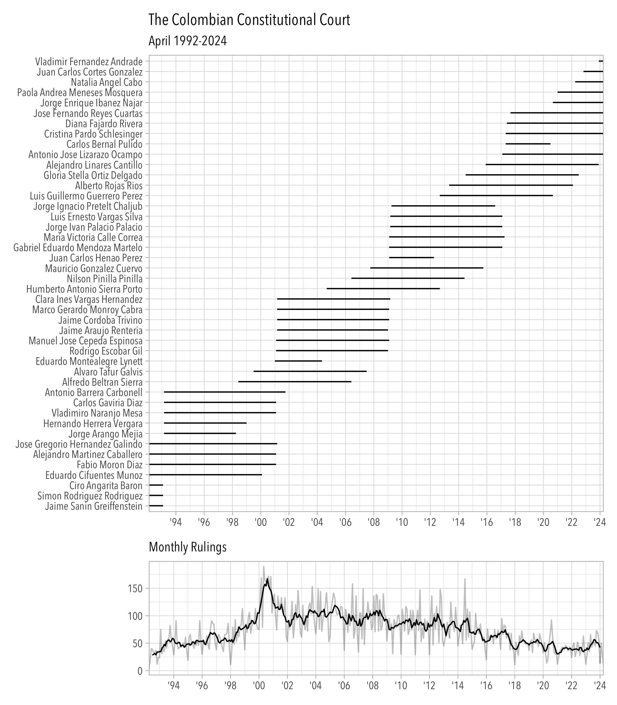

<!-- README.md is generated from README.Rmd. Please edit that file -->

# cccLLM

<!-- badges: start -->

[](https://github.com/acastroaraujo/cccLLM/actions/workflows/R-CMD-check.yaml)

<!-- badges: end -->

This package contains a collection of datasets about the Colombian
Constitutional Court. Most of them were processed with the help of Large
Language Models. It is meant to complement the datasets collected in the
[ccc](https://acastroaraujo.github.io/ccc/) package.

## Installation

You can install the development version of cccLLM from
[GitHub](https://github.com/) with:

``` r
# install.packages("pak")
pak::pak("acastroaraujo/cccLLM")
```

To cite `cccLLM` in publications use:

    @Manual{,
      title = {cccLLM: Colombian Constitutional Court Datasets},
      author = {Andrés {Castro Araújo}},
      year = {2025},
      note = {R package version 0.1.0, 
    https://acastroaraujo.github.io/cccLLM/},
      url = {https://github.com/acastroaraujo/cccLLM},
    }


